# Urban Pulse AI

  

  <strong>Evidence-aware civic reporting and response intelligence for Bengaluru.</strong>

  
  
  
  
  

Urban Pulse AI turns citizen evidence into a structured civic case. Citizens can report an issue using text, voice, an image, and location; the platform then performs visual understanding, classifies risk, resolves the Bengaluru ward and department, preserves an auditable decision trail, and supports authority handoff and community verification.

> [!IMPORTANT]
> Urban Pulse is a decision-support platform. External search context, weather, and visual observations never independently accept, reject, route, or close a complaint. Uncertain evidence remains eligible for human review, and provider failure does not block complaint submission.

## Contents

- [What It Does](#what-it-does)
- [Reporting UI](#reporting-ui)
- [Architecture](#architecture)
- [Decision Boundaries](#decision-boundaries)
- [Quick Start](#quick-start)
- [Configuration](#configuration)
- [Verification](#verification)
- [Deployment](#deployment)
- [API Surface](#api-surface)
- [Contributing](#contributing)

## What It Does

| Capability | Production behavior |
| --- | --- |
| Multimodal reporting | Accepts text, voice transcript, JPEG/PNG/WebP evidence, and Bengaluru location |
| Visual perception | Uses Florence-2 on Cloud Run for structured scene observations, hazards, infrastructure, image quality, and uncertainty |
| Civic reasoning | Determines category, priority, threat score, safety gate, and review requirements inside Urban Pulse |
| Bengaluru routing | Resolves ward evidence and routes to configurable BBMP-aligned departments and escalation destinations |
| Community verification | Nearby eligible users can mark an issue as still present, worsening, resolved, or duplicated without seeing reporter identity |
| Authority workflow | Supports tracked manual-portal, email, or webhook handoff with retries, references, reconciliation, and SLA monitoring |
| Incident intelligence | Detects duplicate clusters, emergency broadcasts, incident commands, follow-ups, and ward-level risk pressure |
| Accountability | Stores human corrections, append-only decision audits, confidence signals, and provider observability |
| External context | Adds quota-controlled weather and civic references without overriding civic decisions |
| Resilience | Falls back safely when optional providers fail and always preserves complaint submission |

### Supported Bengaluru Departments

- Solid Waste Management
- Roads and Infrastructure
- Electrical and Street Lighting
- Storm Water Drains and Drainage
- Public Health
- Animal Husbandry
- Parks and Urban Forestry
- Water-related Civic Services
- General Ward Administration

## Reporting UI

  

Screenshot placeholder: add the final reporting screen at <code>report.png</code> in the repository root.

The report workspace provides immediate image-analysis states, a failure-only **Re-submit Image** action, inline submission progress, location preview, and a unified result panel. Complaint details use a responsive modal workspace for routing, evidence, verification, authority status, timelines, and human review.

## Architecture

~~~mermaid
flowchart LR
    Citizen[Citizen / Admin] --> UI[Liquid-glass Web UI]
    UI --> API[Express API]
    API --> DB[(MongoDB Atlas)]
    API --> AI[Flask AI Service]
    AI --> Vision[Florence-2 Google Cloud Run]
    AI --> Decision[Urban Pulse Decision Engine]
    Decision --> API
    API --> Route[Bengaluru Routing]
    API --> Authority[Authority Adapter]
    API --> Context[Weather + Civic Search]
    API --> Mail[SMTP / Alerts]
~~~

### Service Responsibilities

| Service | Owns |
| --- | --- |
| Browser UI | Authentication, reporting, image preparation, dashboards, maps, verification, and accessible feedback |
| Express API | Authentication, validation, persistence, quotas, routing, authority workflow, email, reports, and permissions |
| Flask AI service | Provider orchestration, multimodal fusion, confidence calibration, threat reasoning, and human-review gates |
| Florence Cloud Run | Sanitized image perception only; it cannot route, prioritize, accept, or close complaints |
| MongoDB Atlas | Users, OTP state, complaints, audits, clusters, commands, tickets, quotas, and operational history |

### Complaint Lifecycle

~~~mermaid
sequenceDiagram
    participant U as Citizen
    participant W as Web
    participant A as Express API
    participant I as AI Service
    participant V as Florence
    participant D as MongoDB

    U->>W: Add evidence and Bengaluru location
    W->>A: Preview image analysis
    A->>I: Sanitized analysis request
    I->>V: Compressed image
    V-->>I: Structured observations
    I-->>A: Evidence-aware decision support
    U->>A: Submit complaint
    A->>A: Validate, assess, route, and apply safety gates
    A->>D: Store case, routing, audit, and follow-up state
    A-->>W: Trackable complaint result
~~~

## Decision Boundaries

Florence supplies observations such as scene description, visible issues, damaged infrastructure, hazards, environmental conditions, image quality, and uncertainty. Urban Pulse remains responsible for:

- final complaint category and priority;
- threat score and emergency safety gate;
- ward, department, and authority routing;
- duplicate and incident-cluster decisions;
- community-verification effects;
- authority communication and escalation;
- closure and resolution verification.

Images are validated, resized, compressed, and hashed before external processing. Successful observations are cached by image hash. Invalid responses, timeouts, unavailable providers, and unclear images degrade to review-safe states instead of producing forced certainty.

## Tech Stack

| Layer | Technology |
| --- | --- |
| Frontend | Semantic HTML, CSS, JavaScript, React 19 bridge, liquid-glass-react |
| API | Node.js, Express, Mongoose, JWT |
| AI | Python 3.11, Flask, sentence-transformers, structured vision provider chain |
| Vision | Florence-2 container, PyTorch CPU, Google Cloud Run |
| Data | MongoDB Atlas |
| Integrations | Deepgram, Nodemailer/SMTP, Weatherstack, Zenserp, Nominatim |
| Deployment | Render, Google Cloud Build, Artifact Registry, Cloud Run |

## Project Layout

~~~text
Urban-Pulse-Ai/
├── public/                  Browser application and visual assets
├── src/                     Express API, models, middleware, and services
├── ai_service/              Flask civic-intelligence service
├── urban-pulse-florence/    Independent Florence-2 Cloud Run container
├── shared/                  Versioned category contract
├── dataset/benchmark/       Evaluation dataset and manifests
├── scripts/                 Verification, evaluation, and seed tools
├── docs/                    Focused engineering documentation
├── render.yaml              Render service definitions
└── .env.example             Local configuration template
~~~

## Quick Start

### Prerequisites

- Node.js 20+
- Python 3.11
- MongoDB local or Atlas
- npm

### Install

~~~bash
git clone <your-repository-url>
cd Urban-Pulse-Ai

npm ci
python3 -m venv .venv
.venv/bin/pip install -r ai_service/requirements.txt
cp .env.example .env
~~~

Set at minimum <code>MONGODB_URI</code>, <code>JWT_SECRET</code>, and the shared AI service token in <code>.env</code>.

### Run

Terminal 1:

~~~bash
npm run start:ai
~~~

Terminal 2:

~~~bash
npm start
~~~

Open [http://localhost:3000](http://localhost:3000). The Flask service runs at <code>http://127.0.0.1:5000</code> by default.

Optional demo data:

~~~bash
npm run seed
~~~

> [!CAUTION]
> <code>npm run seed:fresh</code> deletes existing application data before reseeding. Never use it against a production database.

## Configuration

Start from [.env.example](.env.example). Keep every credential server-side and use independent secrets for production.

### Required Core Variables

| Variable | Purpose |
| --- | --- |
| <code>MONGODB_URI</code> | MongoDB connection string |
| <code>JWT_SECRET</code> | Signing secret; at least 32 characters in production |
| <code>CORS_ORIGIN</code> | Allowed production web origin |
| <code>AI_SERVICE_URL</code> | Flask service base URL |
| <code>AI_SERVICE_TOKEN</code> | Shared Express-to-Flask service secret |
| <code>AI_SERVICE_TIMEOUT_MS</code> | Express deadline for AI requests |

### Authentication And Email

| Variable | Purpose |
| --- | --- |
| <code>SMTP_HOST</code>, <code>SMTP_PORT</code>, <code>SMTP_SECURE</code> | SMTP transport |
| <code>SMTP_USER</code>, <code>SMTP_PASS</code>, <code>SMTP_FROM</code> | OTP sender credentials |
| <code>SMTP_FAMILY=4</code> | Prefer IPv4 where the host cannot reach Gmail IPv6 |
| <code>ALLOW_ROLE_TOKEN_ISSUE=false</code> | Disable development token issuance in production |

### Vision Service

These variables belong to the **Flask AI service**, not the browser:

| Variable | Recommended value |
| --- | --- |
| <code>VISION_PROVIDER_ORDER</code> | <code>florence</code> |
| <code>FLORENCE_REMOTE_ENABLED</code> | <code>true</code> |
| <code>FLORENCE_SERVICE_URL</code> | Cloud Run service URL |
| <code>FLORENCE_SERVICE_TOKEN</code> | Same long secret configured on Cloud Run |
| <code>FLORENCE_TIMEOUT_SECONDS</code> | <code>50</code> |
| <code>FLORENCE_MAX_RETRIES</code> | <code>1</code> |
| <code>FLORENCE_ENABLED</code> | <code>false</code> on memory-limited Render instances |

The Cloud Run container preloads Florence before accepting traffic. <code>min-instances=0</code> reduces idle cost but permits a first-request cold start; <code>min-instances=1</code> reduces latency and adds idle cost.

### Optional Providers

| Variable | Purpose |
| --- | --- |
| <code>DEEPGRAM_API_KEY</code> | Voice transcription |
| <code>WEATHERSTACK_API_KEY</code> | Weather-sensitive incident context |
| <code>WEATHERSTACK_MONTHLY_LIMIT=90</code> | Global UTC monthly Weatherstack cap |
| <code>ZENSERP_API_KEY</code> | Official-source and public-context search |
| <code>ZENSERP_MONTHLY_LIMIT=48</code> | Global UTC monthly Zenserp cap |

Provider quota or failure never prevents complaint submission.

### Authority Adapter

Set <code>AUTHORITY_ADAPTER</code> to <code>disabled</code>, <code>email</code>, or <code>webhook</code>.

| Mode | Required variables |
| --- | --- |
| <code>disabled</code> | None; manual portal handoff remains available where configured |
| <code>email</code> | <code>AUTHORITY_TICKET_EMAIL</code>, SMTP variables |
| <code>webhook</code> | <code>AUTHORITY_WEBHOOK_URL</code>, optional <code>AUTHORITY_WEBHOOK_TOKEN</code> |

<strong>Production configuration checklist</strong>

- Use a dedicated MongoDB production database.
- Generate unique <code>JWT_SECRET</code>, <code>AI_SERVICE_TOKEN</code>, and <code>FLORENCE_SERVICE_TOKEN</code> values.
- Keep <code>ALLOW_ROLE_TOKEN_ISSUE=false</code>.
- Keep <code>FLORENCE_ENABLED=false</code> on the Render AI service.
- Configure identical Florence service tokens in Render and Cloud Run.
- Restrict <code>CORS_ORIGIN</code> to the deployed frontend.
- Use a Gmail app password or a transactional SMTP provider.
- Verify <code>/health</code> and <code>/ready</code> for all deployed services.
- Run <code>npm run verify:release</code> before promotion.

## Verification

### Primary Release Gate

~~~bash
npm run verify:release
~~~

### Focused Checks

| Command | Validates |
| --- | --- |
| <code>npm run verify:syntax</code> | JavaScript syntax and application loading |
| <code>npm run verify:accessibility</code> | Dialogs, labels, IDs, feedback, reduced motion |
| <code>npm run verify:image-reasoning</code> | Image decision behavior and uncertainty |
| <code>npm run verify:florence-remote</code> | Cloud provider contract, timeout, cache, authentication |
| <code>npm run verify:florence-service</code> | Standalone Florence service |
| <code>npm run verify:bengaluru-routing</code> | Ward and department routing |
| <code>npm run verify:community-verification</code> | Privacy-safe nearby verification |
| <code>npm run verify:authority-tickets</code> | Authority adapters and ticket state |
| <code>npm run verify:decision-audit</code> | Hash-chained correction history |
| <code>npm run verify:resilience</code> | Failure-safe behavior |
| <code>npm run verify:smtp</code> | SMTP connectivity and sender configuration |

### AI Evaluation

~~~bash
npm run dataset:validate
npm run evaluate:benchmark:readiness
npm run evaluate:ai
~~~

Benchmark manifests preserve provenance, privacy-review state, independent annotations, and leakage-safe dataset splits. Model promotion should be based on category metrics, calibration, safety regressions, fallback rate, and latency rather than demonstration examples.

## Deployment

### Render

The repository includes [render.yaml](render.yaml) for:

1. <code>smart-community-ai</code> — Flask AI orchestration service.
2. <code>smart-community-web</code> — Express API and frontend.

Create both services, set all <code>sync: false</code> secrets in the Render dashboard, and ensure <code>AI_SERVICE_URL</code> points from the web service to the deployed Flask service.

### Florence On Cloud Run

~~~bash
cd urban-pulse-florence

gcloud builds submit \
  --tag asia-south1-docker.pkg.dev/PROJECT_ID/urban-pulse/florence-vision:prod

gcloud run deploy urban-pulse-florence \
  --image asia-south1-docker.pkg.dev/PROJECT_ID/urban-pulse/florence-vision:prod \
  --region asia-south1 \
  --cpu 2 \
  --memory 4Gi \
  --concurrency 1 \
  --timeout 120 \
  --min-instances 0 \
  --max-instances 1 \
  --startup-cpu-boost \
  --allow-unauthenticated \
  --set-env-vars FLORENCE_SERVICE_TOKEN=REPLACE_ME,FLORENCE_WARMUP=true,REQUIRE_SERVICE_TOKEN=true
~~~

<code>--allow-unauthenticated</code> only exposes the HTTPS route. <code>/v1/analyze</code> still requires the shared application token.

Verify before connecting Render:

~~~bash
curl https://YOUR_CLOUD_RUN_URL/health
curl https://YOUR_CLOUD_RUN_URL/ready
~~~

See [urban-pulse-florence/README.md](urban-pulse-florence/README.md) for the authenticated image smoke test and container details.

## API Surface

All complaint, dashboard, user, verification, and authority routes require JWT authentication and permission checks.

<strong>Authentication</strong>

- <code>POST /api/auth/register/request-otp</code>
- <code>POST /api/auth/register</code>
- <code>POST /api/auth/login</code>
- <code>POST /api/auth/password-reset/request-otp</code>
- <code>POST /api/auth/password-reset</code>

<strong>Reporting and intelligence</strong>

- <code>POST /api/analyze-image</code>
- <code>POST /api/analyze-complaint</code>
- <code>GET /api/complaints/:id</code>
- <code>POST /api/transcribe-audio</code>
- <code>GET /api/dashboard</code>
- <code>POST /api/email-authority</code>

<strong>Verification, review, and authority workflow</strong>

- <code>POST /api/complaints/:id/community-verification</code>
- <code>POST /api/complaints/:id/resolution-evidence</code>
- <code>POST /api/complaints/:id/human-review</code>
- <code>GET /api/complaints/:id/decision-audit</code>
- <code>POST /api/complaints/:id/authority-ticket</code>
- <code>POST /api/complaints/:id/authority-ticket/retry</code>
- <code>PATCH /api/authority-tickets/:ticketId/reconcile</code>

## Operational Notes

- **OTP not received:** verify SMTP credentials, Gmail app password, sender identity, and <code>SMTP_FAMILY=4</code>; failed delivery never reports success.
- **Image analysis unavailable:** check the Flask service, Cloud Run <code>/ready</code>, shared token equality, revision logs, and cold-start timing. Re-submit Image retries the retained photo.
- **Provider quota reached:** weather and civic-search providers return unavailable snapshots while complaint creation continues.
- **Authority delivery failed:** inspect the authority ticket attempt history and retry only when its retry window opens.
- **Unclear image:** request better evidence or use human review; never reinterpret low-confidence observations as confirmed facts.

## Security And Privacy

- API keys and provider tokens remain backend-only.
- Passwords and OTPs are stored as hashes; OTP attempts and expiry are bounded.
- JWT permissions protect administrative operations.
- Reporter identity and private evidence are hidden from community verifiers.
- Image MIME type, decoded format, dimensions, pixels, and payload size are validated.
- External URLs and model responses are constrained and sanitized.
- Decision corrections are append-only and hash chained.
- Secrets, raw image contents, and credentials are excluded from provider logs.

Please report vulnerabilities privately to the project maintainer rather than opening a public issue.

## Roadmap

- Authorized government APIs for direct ticket creation, acknowledgement, officer assignment, and synchronized resolution.
- Official BBMP ward-boundary datasets and periodically versioned department directories.
- Mobile push notifications and multilingual citizen reporting.
- Field-officer workflows with signed resolution evidence.
- Public transparency views using privacy-preserving aggregate data.

## Contributing

1. Fork the repository and create a focused branch.
2. Preserve the Bengaluru scope and existing API contracts.
3. Add tests for behavior changes and provider failure paths.
4. Run <code>npm run verify:release</code>.
5. Open a pull request describing the problem, decision, tests, and operational impact.

Contributions must not expose reporter information, move civic decisions into an external provider, or make optional integrations block complaint submission.

## License

Released under the MIT license as declared in [package.json](package.json).

  

Built for evidence-aware, accountable civic response.

