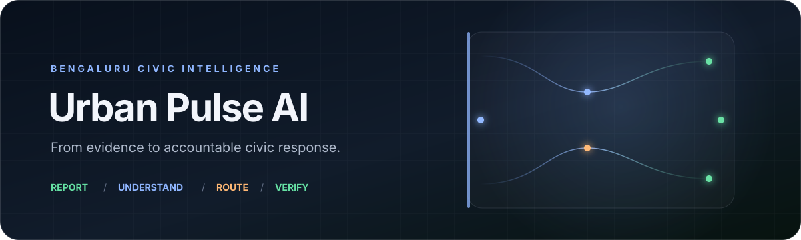

# Urban Pulse AI

  

  <strong>Evidence-aware civic reporting and response intelligence for Bengaluru.</strong>

  
  
  
  
  

Urban Pulse AI turns citizen evidence into a structured civic case. Citizens can report an issue using text, voice, an image, and location; the platform then performs visual understanding, classifies risk, resolves the Bengaluru ward and department, preserves an auditable decision trail, and supports authority handoff and community verification.

> [!IMPORTANT]
> Urban Pulse is a decision-support platform. External search context, weather, and visual observations never independently accept, reject, route, or close a complaint. Uncertain evidence remains eligible for human review, and provider failure does not block complaint submission.

## Contents

- [What It Does](#what-it-does)
- [Feature Catalogue](#feature-catalogue)
- [Reporting UI](#reporting-ui)
- [Architecture](#architecture)
- [Decision Boundaries](#decision-boundaries)
- [Quick Start](#quick-start)
- [Configuration](#configuration)
- [Verification](#verification)
- [Deployment](#deployment)
- [API Surface](#api-surface)
- [Contributing](#contributing)

## What It Does

| Capability | Production behavior |
| --- | --- |
| Multimodal reporting | Accepts text, voice transcript, JPEG/PNG/WebP evidence, and Bengaluru location |
| Visual perception | Uses Florence-2 on AWS EC2 for structured scene observations, hazards, infrastructure, image quality, and uncertainty |
| Civic reasoning | Determines category, priority, threat score, safety gate, and review requirements inside Urban Pulse |
| Bengaluru routing | Resolves ward evidence and routes to configurable BBMP-aligned departments and escalation destinations |
| Community verification | Nearby eligible users can mark an issue as still present, worsening, resolved, or duplicated without seeing reporter identity |
| Authority workflow | Supports tracked manual-portal, email, or webhook handoff with retries, references, reconciliation, and SLA monitoring |
| Incident intelligence | Detects duplicate clusters, emergency broadcasts, incident commands, follow-ups, and ward-level risk pressure |
| Accountability | Stores human corrections, append-only decision audits, confidence signals, and visual-service observability |
| External context | Shows location weather, weather-sensitive guidance, official civic references, and relevant public context using quota-controlled, cached providers |
| Citizen communication | Provides local-area email alerts, emergency broadcasts, authority email, contact notifications, PDF reports, and complaint timelines |
| Administrative operations | Provides city-health metrics, complaint queues, maps, risk forecasts, incident rooms, SLA governance, user management, and provider-usage visibility |
| Resilience | Degrades safely when optional external services fail and always preserves complaint submission |

### Supported Bengaluru Departments

- Solid Waste Management
- Roads and Infrastructure
- Electrical and Street Lighting
- Storm Water Drains and Drainage
- Public Health
- Animal Husbandry
- Parks and Urban Forestry
- Water-related Civic Services
- General Ward Administration

## Feature Catalogue

This section maps the implemented software features to their purpose and is suitable as a functional summary for project documentation.

### Identity And Access

- **Email-based registration:** Citizen accounts are created only after an OTP sent to the entered email address is verified.
- **Login and role permissions:** JWT sessions distinguish Citizen and Admin capabilities, while disabled accounts and stale token versions are rejected.
- **Forgot password:** Registered users can request an email OTP and set a new password after verification.
- **Administrative account management:** Authorized admins can inspect accounts, change supported account settings, disable access, and remove users.
- **Abuse controls:** Authentication, OTP, transcription, chatbot, weather preview, complaint actions, and general APIs use bounded rate limits.

### Citizen Reporting

- **Text, voice, image, and location input:** A complaint can combine typed text, an editable Deepgram transcript, JPEG/PNG/WebP evidence, a typed Bengaluru location, or browser geolocation.
- **Image preview analysis:** Citizens see the visible incident, scene description, hazards, evidence confidence, image quality, text-image consistency, and review recommendation before submission.
- **Retry without re-uploading:** If visual analysis is delayed or unavailable, **Re-submit Image** retries the retained prepared image.
- **Local draft recovery:** In-progress report text and location are saved in browser storage and can be restored after navigation or refresh.
- **Map and weather preview:** **Show Map** opens an in-page location dialog without leaving the report, while **Check Weather** explicitly retrieves current condition, temperature, rainfall, humidity, and wind for a typed or live location.
- **Weather-sensitive guidance:** Rain and wind context can add cautious guidance for drainage, flooding, sewage, electrical, fire, fallen-tree, road, vehicle, and water-leak complaints.
- **Inline submission progress:** The form reports evidence analysis, hazard review, ward selection, department routing, checked-context reuse, persistence, and completion without opening a separate result window.
- **Portable complaint record:** After submission, users can generate a PDF, email the authority, and notify up to five chosen contacts.
- **Adaptive reporting workspace:** Desktop keeps the full information-rich composition, while tablet and phone layouts reflow navigation, location tools, evidence, progress, complaint details, and actions without hiding core functionality.
- **Mobile-safe interaction:** Compact layouts use touch-sized controls, safe-area spacing, full-height dialogs, keyboard-safe form sizing, and a static video presentation that avoids scroll-linked rendering work.

### Civic Intelligence And Safety

- **Structured scene understanding:** Florence-2 returns observations rather than final civic decisions, including multiple simultaneous issues, affected infrastructure, hazards, environmental conditions, uncertainty, and evidence limitations.
- **Multimodal reasoning:** Urban Pulse combines visual observations with complaint text, voice, location, previous reports, and area context.
- **Threat assessment:** The internal decision layer calculates threat level, risk evidence, integrity signals, duplicate correlation, and a safety-gate action.
- **Review-safe uncertainty:** Blurry, unrelated, contradictory, malformed, unavailable, or low-confidence evidence is marked for more evidence or human review instead of being forced into a confident category.
- **Duplicate and cluster intelligence:** Related reports can be grouped into an incident cluster while preserving each original complaint record.
- **Human correction:** Authorized reviewers can confirm or correct category, priority, and department decisions using controlled options.
- **Decision audit:** Corrections and important case decisions are written to an append-only, hash-chained audit history.
- **AI observability and benchmarking:** Florence outcomes, latency, uncertainty, review escalation, category behavior, benchmark manifests, and model-comparison policy support controlled evaluation.

### Bengaluru Operations

- **Ward and department routing:** The routing layer uses Bengaluru location evidence, ward matching, category, severity, workload, and a versioned routing registry instead of hardcoded controller logic.
- **Configurable authority handoff:** Complaints support manual official-portal submission, email delivery, or webhook adapters with delivery attempts and external references.
- **Authority SLA governance:** Handoff, acknowledgement, and resolution deadlines can be evaluated, escalated, retried, and reconciled.
- **Emergency broadcasts:** High-risk incidents can notify eligible nearby users while recording channels, recipients, delivery status, and send time.
- **Area-based citizen alerts:** Registered users can save Bengaluru areas and receive email alerts when matching complaints reach their selected severity threshold.
- **Community verification:** Eligible nearby users can report that an issue is still present, worsening, resolved, or duplicated without seeing reporter details.
- **Resolution loop:** Authority resolution updates can request citizen follow-up evidence; unresolved or worsening conditions return to review and escalation.
- **Incident command:** Qualifying cases can open operational response rooms with severity, assigned unit, SLA, checklist, risk score, and status.
- **Operational dashboards:** Admin views include complaint metrics, alert queues, mapped incidents, clusters, command rooms, city-health indicators, risk forecasts, community cases, and AI observability.

### External Context And Communication

- **Weatherstack context:** **Check Weather** explicitly retrieves current local conditions before submission and stores a short-lived server-owned draft snapshot.
- **Weather cache:** Nearby coordinates and equivalent Bengaluru area names reuse MongoDB-cached observations for 45 minutes by default.
- **Image-grounded area context:** **Check Civic Context** unlocks only after image analysis completes, then searches using the exact detected issue, related visible problems, hazards, affected infrastructure, and Bengaluru area to find relevant official resources and recent local updates.
- **Official and public result separation:** Configured civic/government domains are marked as verified official sources; other relevant results remain supporting public context and never control routing or severity.
- **Search cache:** Equivalent area/category searches are cached to reduce external usage.
- **Global monthly quotas:** Atomic MongoDB counters cap Weatherstack at 90 and Zenserp at 48 attempted external calls per UTC calendar month by default.
- **Admin usage view:** Administrators can see used and remaining monthly provider calls; citizens see only useful availability states.
- **Failure isolation:** Missing keys, quota exhaustion, malformed responses, timeouts, or empty results never block complaint creation.
- **Chatbot assistance:** The authenticated assistant supports navigation, complaint questions, status guidance, and project FAQs with stored chat history and a clear-history action.

## Reporting UI

  

Screenshot placeholder: add the final reporting screen at <code>report.png</code> in the repository root.

The report workspace provides immediate image-analysis states, a failure-only **Re-submit Image** action, browser-geolocation support, an in-page map dialog, explicit local-weather lookup, draft recovery, voice transcription, inline submission progress, and a unified result panel. The result includes the selected ward and authority, conditions at submission, verified civic references, public context, and report actions. Complaint details use a responsive modal workspace for routing, evidence, verification, authority status, timelines, public context, weather, threat assessment, resolution, and human review.

## Architecture

~~~mermaid
flowchart LR
    Citizen[Citizen / Admin] --> UI[Liquid-glass Web UI]
    UI --> API[Express API]
    API --> DB[(MongoDB Atlas)]
    API --> AI[Flask AI Service]
    AI --> Florence[Florence-2 Visual Service AWS EC2]
    AI --> Decision[Urban Pulse Decision Engine]
    Decision --> API
    API --> Route[Bengaluru Routing]
    API --> Authority[Authority Adapter]
    API --> Context[Weather + Civic Search]
    Context --> Quota[Monthly Quota Guard]
    Context --> Cache[(Mongo Context Cache)]
    API --> Mail[SMTP / Alerts]
~~~

### Service Responsibilities

| Service | Owns |
| --- | --- |
| Browser UI | Authentication, reporting, image preparation, dashboards, maps, verification, and accessible feedback |
| Express API | Authentication, validation, persistence, quotas, routing, authority workflow, email, reports, and permissions |
| Flask AI service | Florence observation integration, multimodal fusion, confidence calibration, threat reasoning, and human-review gates |
| Florence on AWS EC2 | Sanitized image perception only; it cannot route, prioritize, accept, or close complaints |
| MongoDB Atlas | Users, OTP state, complaints, audits, clusters, commands, tickets, provider quotas, external-context cache, and operational history |

### Complaint Lifecycle

~~~mermaid
sequenceDiagram
    participant U as Citizen
    participant W as Web
    participant A as Express API
    participant I as AI Service
    participant V as Florence-2 service
    participant C as Context providers
    participant D as MongoDB

    U->>W: Add evidence and Bengaluru location
    W->>A: Request local conditions
    A->>D: Check weather cache and quota
    A->>C: Fetch only on cache miss
    A-->>W: Current conditions and cautious guidance
    W->>A: Preview image analysis
    A->>I: Sanitized analysis request
    I->>V: Compressed image
    V-->>I: Structured observations
    I-->>A: Evidence-aware decision support
    A->>D: Store short-lived image-analysis token
    U->>W: Check civic context
    W->>A: Send image-analysis token and location
    A->>D: Validate token and check search cache/quota
    A->>C: Search only on explicit request and cache miss
    A-->>W: Official resources and area updates
    U->>A: Submit complaint
    A->>A: Validate, assess, route, and apply safety gates
    A->>D: Validate and reuse checked draft snapshots
    A->>D: Store case, context, routing, audit, and follow-up state
    A-->>W: Trackable result with civic references
~~~

## Decision Boundaries

Florence-2 supplies observations such as scene description, visible issues, damaged infrastructure, hazards, environmental conditions, image quality, and uncertainty. Urban Pulse remains responsible for:

- final complaint category and priority;
- threat score and emergency safety gate;
- ward, department, and authority routing;
- duplicate and incident-cluster decisions;
- community-verification effects;
- authority communication and escalation;
- closure and resolution verification.

Images are validated, resized, compressed, and hashed before Florence processing. Successful observations are cached by image hash. Invalid responses, timeouts, service unavailability, and unclear images degrade to review-safe states instead of producing forced certainty.

## Tech Stack

| Layer | Technology |
| --- | --- |
| Frontend | Semantic HTML, CSS, JavaScript, React 19 bridge, liquid-glass-react |
| API | Node.js, Express, Mongoose, JWT |
| AI | Python 3.11, Flask, sentence-transformers, structured Florence integration |
| Vision | Florence-2 container, PyTorch CPU, AWS EC2 |
| Data | MongoDB Atlas |
| Integrations | Deepgram, Nodemailer/SMTP, Weatherstack, Zenserp, Nominatim |
| Deployment | Render and AWS EC2 |

## Project Layout

~~~text
Urban-Pulse-Ai/
├── public/                  Browser application and visual assets
├── src/                     Express API, models, middleware, and services
├── ai_service/              Flask civic-intelligence service
├── urban-pulse-florence/    Independent Florence-2 AWS EC2 container
├── shared/                  Versioned category contract
├── dataset/benchmark/       Evaluation dataset and manifests
├── scripts/                 Verification, evaluation, and seed tools
├── docs/                    Focused engineering documentation
├── render.yaml              Render service definitions
└── .env.example             Local configuration template
~~~

## Quick Start

### Prerequisites

- Node.js 20+ or above
- Python 3.11
- MongoDB local or Atlas
- npm

### Install

~~~bash
git clone <your-repository-url>
cd Urban-Pulse-Ai

npm ci
python3 -m venv .venv
.venv/bin/pip install -r ai_service/requirements.txt
cp .env.example .env
~~~

Set at minimum <code>MONGODB_URI</code>, <code>JWT_SECRET</code>, and the shared AI service token in <code>.env</code>.

### Run

Terminal 1:

~~~bash
npm run start:ai
~~~

Terminal 2:

~~~bash
npm start
~~~

Open [http://localhost:3000](http://localhost:3000). The Flask service runs at <code>http://127.0.0.1:5000</code> by default.

Optional demo data:

~~~bash
npm run seed
~~~

> [!CAUTION]
> <code>npm run seed:fresh</code> deletes existing application data before reseeding. Never use it against a production database.

## Configuration

Start from [.env.example](.env.example). Keep every credential server-side and use independent secrets for production.

### Required Core Variables

| Variable | Purpose |
| --- | --- |
| <code>MONGODB_URI</code> | MongoDB connection string |
| <code>JWT_SECRET</code> | Signing secret; at least 32 characters in production |
| <code>CORS_ORIGIN</code> | Allowed production web origin |
| <code>AI_SERVICE_URL</code> | Flask service base URL |
| <code>AI_SERVICE_TOKEN</code> | Shared Express-to-Flask service secret |
| <code>AI_SERVICE_TIMEOUT_MS</code> | Express deadline for AI requests |

### Authentication And Email

| Variable | Purpose |
| --- | --- |
| <code>SMTP_HOST</code>, <code>SMTP_PORT</code>, <code>SMTP_SECURE</code> | SMTP transport |
| <code>SMTP_USER</code>, <code>SMTP_PASS</code>, <code>SMTP_FROM</code> | OTP sender credentials |
| <code>SMTP_FAMILY=4</code> | Prefer IPv4 where the host cannot reach Gmail IPv6 |
| <code>ALLOW_ROLE_TOKEN_ISSUE=false</code> | Disable development token issuance in production |

### Vision Service

These variables belong to the **Flask AI service**, not the browser:

| Variable | Recommended value |
| --- | --- |
| <code>FLORENCE_REMOTE_ENABLED</code> | <code>true</code> |
| <code>FLORENCE_SERVICE_URL</code> | AWS Florence base URL, without <code>/v1/analyze</code> |
| <code>FLORENCE_ALLOW_HTTP</code> | Keep <code>false</code>; use <code>true</code> only for an explicitly accepted IP-based test deployment |
| <code>FLORENCE_SERVICE_TOKEN</code> | Same long secret configured in EC2 <code>~/florence.env</code> |
| <code>FLORENCE_TIMEOUT_SECONDS</code> | <code>80</code> for the current CPU deployment |
| <code>FLORENCE_MAX_RETRIES</code> | <code>0</code> to remain inside the web request deadline |
| <code>FLORENCE_ENABLED</code> | <code>false</code> on memory-limited Render instances |

The EC2 container preloads Florence before Gunicorn accepts traffic. Once <code>/ready</code> returns <code>200</code>, image requests do not incur a model cold start unless the instance or container is restarted. The container uses <code>--restart unless-stopped</code> so it returns automatically after an EC2 restart.

### Optional Providers

| Variable | Purpose |
| --- | --- |
| <code>DEEPGRAM_API_KEY</code> | Voice transcription |
| <code>WEATHERSTACK_API_KEY</code> | Weather-sensitive incident context |
| <code>WEATHERSTACK_MONTHLY_LIMIT=90</code> | Global UTC monthly Weatherstack cap |
| <code>WEATHER_CACHE_TTL_MINUTES=45</code> | Reuse nearby current-condition observations without another provider call |
| <code>ZENSERP_API_KEY</code> | Official-source and public-context search |
| <code>ZENSERP_MONTHLY_LIMIT=48</code> | Global UTC monthly Zenserp cap |
| <code>ZENSERP_PUBLIC_CACHE_HOURS=6</code> | Reuse recent area and category context |

The report form calls Weatherstack only when the user presses **Check Weather**. **Check Civic Context** becomes available after terminal image analysis and makes one combined Zenserp search from server-retained visual observations: the primary and secondary issues, visible hazards, affected infrastructure, and entered Bengaluru area. The UI identifies which image-detected incident and area produced the results. Successful checks receive opaque, user-bound draft tokens that expire after two hours; complaint submission validates those tokens and stores their snapshots without calling either provider. Changing the report location invalidates checked context in the browser. Cached results do not consume monthly provider allowance, and skipping, exhausting, or failing either provider never prevents complaint submission.

### Authority Adapter

Set <code>AUTHORITY_ADAPTER</code> to <code>disabled</code>, <code>email</code>, or <code>webhook</code>.

| Mode | Required variables |
| --- | --- |
| <code>disabled</code> | None; manual portal handoff remains available where configured |
| <code>email</code> | <code>AUTHORITY_TICKET_EMAIL</code>, SMTP variables |
| <code>webhook</code> | <code>AUTHORITY_WEBHOOK_URL</code>, optional <code>AUTHORITY_WEBHOOK_TOKEN</code> |

<strong>Production configuration checklist</strong>

- Use a dedicated MongoDB production database.
- Generate unique <code>JWT_SECRET</code>, <code>AI_SERVICE_TOKEN</code>, and <code>FLORENCE_SERVICE_TOKEN</code> values.
- Keep <code>ALLOW_ROLE_TOKEN_ISSUE=false</code>.
- Keep <code>FLORENCE_ENABLED=false</code> on the Render AI service.
- Configure identical Florence service tokens in Render and EC2 <code>~/florence.env</code>.
- Keep the EC2 Elastic IP associated with the instance.
- Expose only the port required by the selected transport.
- Restrict <code>CORS_ORIGIN</code> to the deployed frontend.
- Use a Gmail app password or a transactional SMTP provider.
- Configure Weatherstack and Zenserp limits conservatively; cached responses do not increment monthly usage.
- Verify that admins can load external-context usage while citizens cannot access the admin-only endpoint.
- Verify <code>/health</code> and <code>/ready</code> for all deployed services.
- Run <code>npm run verify:release</code> before promotion.

## Verification

### Primary Release Gate

~~~bash
npm run verify:release
~~~

### Focused Checks

| Command | Validates |
| --- | --- |
| <code>npm run verify:syntax</code> | JavaScript syntax and application loading |
| <code>npm run verify:accessibility</code> | Dialogs, labels, IDs, feedback, reduced motion |
| <code>npm run verify:responsive-ui</code> | Desktop preservation, tablet/phone breakpoints, safe areas, compact media, and mobile navigation |
| <code>npm run verify:image-reasoning</code> | Image decision behavior and uncertainty |
| <code>npm run verify:florence-remote</code> | Remote Florence contract, timeout, cache, authentication |
| <code>npm run verify:florence-service</code> | Standalone Florence service |
| <code>npm run verify:ai-request-tracing</code> | Browser-to-Florence correlation and failure-stage propagation |
| <code>npm run verify:bengaluru-routing</code> | Ward and department routing |
| <code>npm run verify:community-verification</code> | Privacy-safe nearby verification |
| <code>npm run verify:authority-tickets</code> | Authority adapters and ticket state |
| <code>npm run verify:external-context</code> | Bengaluru weather preview, cache reuse, official-domain validation, route permissions, and admin-only quota visibility |
| <code>npm run verify:decision-audit</code> | Hash-chained correction history |
| <code>npm run verify:resilience</code> | Failure-safe behavior |
| <code>npm run verify:smtp</code> | SMTP connectivity and sender configuration |

### AI Evaluation

~~~bash
npm run dataset:validate
npm run evaluate:benchmark:readiness
npm run evaluate:ai
~~~

Benchmark manifests preserve provenance, privacy-review state, independent annotations, and leakage-safe dataset splits. Model promotion should be based on category metrics, calibration, safety regressions, human-review rate, and latency rather than demonstration examples.

## Deployment

### Render

The repository includes [render.yaml](render.yaml) for:

1. <code>smart-community-ai</code> — Flask AI orchestration service.
2. <code>smart-community-web</code> — Express API and frontend.

Create both services, set all <code>sync: false</code> secrets in the Render dashboard, and ensure <code>AI_SERVICE_URL</code> points from the web service to the deployed Flask service.

The web <code>/health</code> endpoint performs a cached live AI authentication probe and reports its status, latency, last success, request ID, and failure stage without exposing secrets. Image-analysis requests preserve the same <code>X-Request-ID</code> through the browser, Express, Flask, and Florence. When an upload fails, use the reference shown in the report UI to locate matching structured logs. Failure stages distinguish browser transport, web authentication, web-to-AI transport, AI authentication, payload validation, and Florence execution.

### Florence On AWS EC2

~~~bash
cd urban-pulse-florence

docker build -t urban-pulse-florence:prod .

docker run -d \
  --name urban-pulse-florence \
  --restart unless-stopped \
  --memory 6g \
  --cpus 2 \
  --env-file ~/florence.env \
  -p 8080:8080 \
  urban-pulse-florence:prod
~~~

The current college-project deployment uses Ubuntu 24.04 on an <code>m7i-flex.large</code> instance in <code>ap-south-1</code>, 30 GB gp3 storage, and an associated Elastic IP. EC2 port <code>8080</code> is reachable for Render integration, while <code>/v1/analyze</code> remains protected by <code>X-Urban-Pulse-Vision-Token</code>.

Verify before connecting Render:

~~~bash
curl http://ELASTIC_IP:8080/health
curl http://ELASTIC_IP:8080/ready

curl -X POST http://ELASTIC_IP:8080/v1/analyze \
  -H "X-Urban-Pulse-Vision-Token: YOUR_SECRET" \
  -F "image=@test-incident.jpg"
~~~

Set the Render AI service to use the EC2 URL, enable remote Florence, disable local Florence loading, and use the same service token. The current direct-IP connection requires <code>FLORENCE_ALLOW_HTTP=true</code>.

> [!CAUTION]
> Direct HTTP is an explicit temporary testing compromise: images and the service token are not transport-encrypted. A public deployment should place HTTPS in front of EC2 and restore <code>FLORENCE_ALLOW_HTTP=false</code>.

See [urban-pulse-florence/README.md](urban-pulse-florence/README.md) for instance setup, container operations, and authenticated verification.

## API Surface

All complaint, dashboard, user, verification, and authority routes require JWT authentication and permission checks.

<strong>Authentication</strong>

- <code>GET /api/roles</code>
- <code>POST /api/auth/token</code> (development only; disabled in production)
- <code>POST /api/auth/register/request-otp</code>
- <code>POST /api/auth/register</code>
- <code>POST /api/auth/login</code>
- <code>POST /api/auth/password-reset/request-otp</code>
- <code>POST /api/auth/password-reset</code>

<strong>Reporting and intelligence</strong>

- <code>POST /api/analyze-image</code>
- <code>POST /api/analyze-complaint</code>
- <code>GET /api/complaints/:id</code>
- <code>POST /api/transcribe-audio</code>
- <code>POST /api/context/weather-preview</code>
- <code>POST /api/context/civic-preview</code>
- <code>GET /api/context/usage</code> (admin only)
- <code>GET /api/dashboard</code>
- <code>POST /api/email-authority</code>
- <code>POST /api/email-bbmp</code> (compatibility alias)
- <code>POST /api/inform-close-contacts</code>
- <code>GET /api/chatbot/history</code>
- <code>POST /api/chatbot/message</code>
- <code>DELETE /api/chatbot/history</code>
- <code>GET /api/local-alert-preferences</code>
- <code>PATCH /api/local-alert-preferences</code>

<strong>Verification, review, and authority workflow</strong>

- <code>POST /api/complaints/:id/community-verification</code>
- <code>POST /api/complaints/:id/community-proof</code> (compatibility alias)
- <code>POST /api/complaints/:id/verification</code>
- <code>POST /api/complaints/:id/resolution-evidence</code>
- <code>POST /api/complaints/:id/human-review</code>
- <code>GET /api/complaints/:id/decision-audit</code>
- <code>GET /api/decision-audit/feedback</code>
- <code>POST /api/complaints/:id/authority-ticket</code>
- <code>POST /api/complaints/:id/authority-ticket/retry</code>
- <code>POST /api/authority-tickets/:ticketId/manual-confirmation</code>
- <code>PATCH /api/authority-tickets/:ticketId/reconcile</code>
- <code>PATCH /api/complaints/:id/status</code>
- <code>POST /api/complaints/:id/alerts/acknowledge</code>
- <code>GET /api/authority-governance</code>
- <code>POST /api/authority-governance/evaluate</code>

<strong>Administration and health</strong>

- <code>PATCH /api/users/:id</code>
- <code>DELETE /api/users/:id</code>
- <code>POST /api/reset-dashboard</code>
- <code>GET /health</code>
- <code>GET /health/live</code>
- <code>GET /health/ready</code>

## Operational Notes

- **OTP not received:** verify SMTP credentials, Gmail app password, sender identity, and <code>SMTP_FAMILY=4</code>; failed delivery never reports success.
- **Image analysis unavailable:** check the Flask service, AWS EC2 <code>/ready</code>, security-group port, container logs, and shared token equality. Re-submit Image retries the retained photo.
- **Weather unavailable:** confirm the location resolves inside Bengaluru, inspect the admin usage panel, and verify Weatherstack configuration. Cached observations and complaint submission remain available independently.
- **Civic references unavailable:** inspect the admin usage panel and Zenserp configuration. Routing and complaint creation continue without search context.
- **Provider quota reached:** the backend skips new provider calls, serves valid cached snapshots where possible, and continues complaint creation.
- **Authority delivery failed:** inspect the authority ticket attempt history and retry only when its retry window opens.
- **Unclear image:** request better evidence or use human review; never reinterpret low-confidence observations as confirmed facts.

## Security And Privacy

- API keys and provider tokens remain backend-only.
- Passwords and OTPs are stored as hashes; OTP attempts and expiry are bounded.
- JWT permissions protect administrative operations.
- Reporter identity and private evidence are hidden from community verifiers.
- Image MIME type, decoded format, dimensions, pixels, and payload size are validated.
- External URLs and model responses are constrained and sanitized.
- Decision corrections are append-only and hash chained.
- Secrets, raw image contents, and credentials are excluded from provider logs.

Please report vulnerabilities privately to the project maintainer rather than opening a public issue.

## Roadmap

- Authorized government APIs for direct ticket creation, acknowledgement, officer assignment, and synchronized resolution.
- Official BBMP ward-boundary datasets and periodically versioned department directories.
- Mobile push notifications and multilingual citizen reporting.
- Field-officer workflows with signed resolution evidence.
- Public transparency views using privacy-preserving aggregate data.

## Contributing

1. Fork the repository and create a focused branch.
2. Preserve the Bengaluru scope and existing API contracts.
3. Add tests for behavior changes and provider failure paths.
4. Run <code>npm run verify:release</code>.
5. Open a pull request describing the problem, decision, tests, and operational impact.

Contributions must not expose reporter information, move civic decisions into an external provider, or make optional integrations block complaint submission.

## License

Project source code is released under the MIT license as declared in [package.json](package.json). Third-party regression media under `dataset/` retains its original Creative Commons terms; see [dataset/ATTRIBUTION.md](dataset/ATTRIBUTION.md).

  

Built for evidence-aware, accountable civic response.

